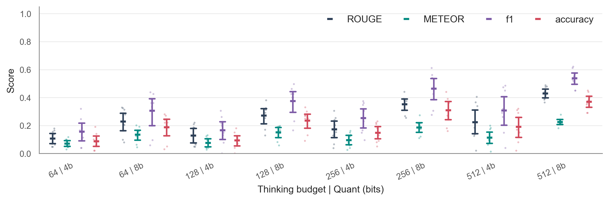
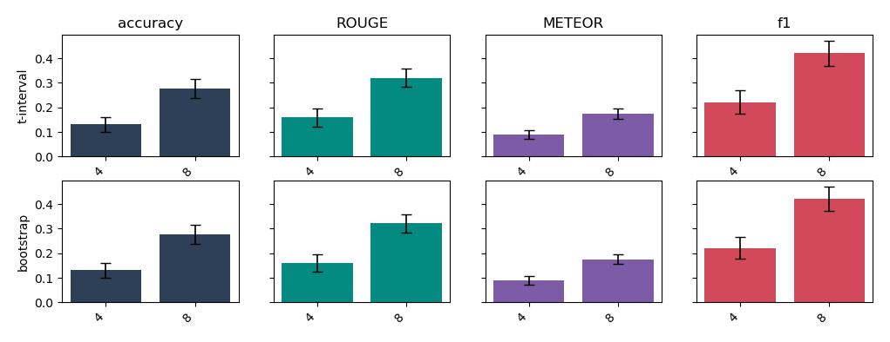
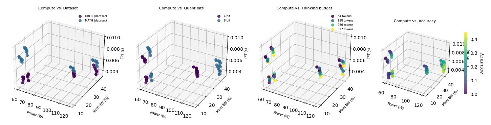
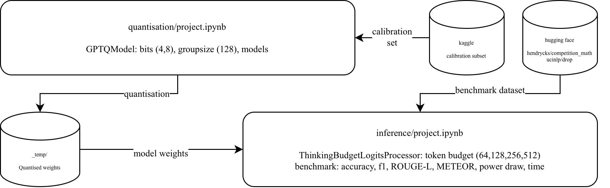

# Quantisation vs. Reasoning Tokens for Model Correctness in Chain-of-Thought (CoT) Thinking Models

*Yvonne Creter - LMU Munich · [ORCID 0009-0009-5528-2053](https://orcid.org/0009-0009-5528-2053)*

In this university project we benchmark the correctness of various quantised models $\in\lbrace 4,8\rbrace \text{ bit}$ across token reasoning budgets $\in\lbrace 64, 128, 256, 512\rbrace \text{ tokens}$ to quantify whether accumulated error at higher quantisation levels can be balanced via increased compute allocation in reasoning.

Our results indicate that this is generally the case, though it comes at the cost of higher inference times, and increased variability in correctness. This repository covers the entire pipeline for evaluating the benchmarks to quantising the models to ensure equal quantisation in terms of calibration dataset and method.

In addition, the repository includes the ported evaluation scripts from *Deepseek-R1* for extracting imprecise answers from thinking leakage, and *VLLM 0.12.0* to *VLLM 0.7.3* for working reasoning budget control on NVIDIA Volta V100 GPUs, infrastructure that was introduced before the popularization of CoT for increasingly complex tasks, and should now work equivalently on newer versions for Volta+ GPU series post-0.12.0 with the default VLLM setup.
Our benchmarks are evaluated on *Qwen3-0.6B* and *DeepSeekR1-1.5B* aiming to tackle resource constraints on edge devices, and may diverge from results with higher parameters. The used datasets *DROP* and *MATH* specifically focus on complex reasoning tasks, considering that simple one-shot answers may have been solved with lower reasoning budgets.








Strong divergence in power draw and memory bandwidth are introduced by quantisation settings and model architecture, and relative accuracy cost per reasoning token increasingly go down at larger budgets indicating significant constant overhead per request.

It can be inferred that resources are best invested in deep quantisation depths with high reasoning token counts for mandatory low-error margins, whereas higher quantisation levels result in lower VRAM requirements, therefore providing a good alternative to correctness on resource-constrained edge devices with complex task requirements, but flexible extendable inference times.

The architecture for evaluating model configurations is composed as follows:
## Architecture

HF Datasets: [DROP](https://huggingface.co/datasets/ucinlp/drop), [MATH](https://huggingface.co/datasets/hendrydong/hendrycks_math), (with [GSM8K](https://huggingface.co/datasets/openai/gsm8k) for calibration)

VLLM-compatible quantisation: GPTQ



Inference engine: VLLM (with KVCache)
Hardware: 1 × V100 GPU w 16 GB VRAM(cuda12.1, sm7.0) · 20 GB Debian 13 Trixie (OS) · 60 GB volume (holding the pipeline, deps, models and results), specified hardware runs ~2h 30min for N=100 samples per run.

The repository is hereby structured as:
## Directory Structure
```
aaml_project/
├── run_pipeline.py          # runs quantisation and inference
├── 1_quantisation/
│   ├── project.ipynb        # GPTQ quantisation notebook
│   ├── pyproject.toml
│   └── _temp/               # quantised weights (generated)
├── 2_inference/
│   ├── project.ipynb        # vLLM benchmarking
│   ├── _worker.py           # subprocess worker: model load + benchmark dispatch
│   ├── scripts/
│   │   ├── benchmark.py        # dataset loading, InfConf, lifecycles, metrics
│   │   ├── inference_utils.py  # ThinkingBudgetLogitsProcessor, GPUMonitor, substitution, promptbuilding
│   │   └── math_equiv.py       # SymPy-based answer equivalence
│   ├── benchmark_results_*.csv # generated per run
│   └── pyproject.toml
└── 3_evaluation/
    ├── notebook.ipynb       # analysis, figures
    ├── scripts/plots.py
    ├── figs/
    └── pyproject.toml
```

The openstack instance may be prepared as follows:
## Setup
A minimum of Volta series GPU with 16GB VRAM and 60GB storage is required.

The Linux distribution may lack native cuda installations, and version compatibility in dependencies strongly depends on GPU architecture. Newer NVIDIA GPUs should run without conflicts according to specifications in *VLLM* documentation:
```
sudo apt install nvidia-cuda-toolkit uv
cd 1_quantisation && uv sync
cd ../2_inference  && uv sync
```

Run:
```
python3 run_pipeline.py                 # full pipeline
python3 run_pipeline.py --quant-only    # quantise only
python3 run_pipeline.py --inf-only      # benchmark only (models must exist)
python3 run_pipeline.py --timeout 10800 # longer timeout (!required for N>100)
```

Run full datasets (or subset of N per dataset):
```
python3 run_pipeline.py --no-smoke --inf-only --subset 800 --runs 5
```

Run pipeline in background:
```
nohup python3 run_pipeline.py --no-smoke --inf-only --subset 800 > pipeline.log 2>&1 &
echo $!
```

| Flag | Description |
|---|---|
| `--no-smoke` | Run on full dataset (default runs only 5-sample smoke test) |
| `--quant-only` / `--inf-only` | Run only quantisation or inference |
| `--subset N` | Benchmark on subset of N samples per dataset (auto specifies `--no-smoke`) |
| `--runs K` | Repeat K times for mitigating noise, metrics appended to CSVs with respective timestamps (default 1) |
| `--cross-val` | Run twice, swapping calibration/benchmark splits |
| `--timeout S` | Per-notebook timeout in seconds (default 7200) |

# Run pipeline
`run_pipeline.py` is a sequential runner for quantisation and inference with respective venvs:
- GPTQ-quantises models, saving to `_temp/` with specified calibration set from kaggle
- loads models from `_temp/` to benchmark CoT LLMs (non-MOE) on specified datasets with CoT think-token injection (VLLM thinking budget) on Volta V100 `sm_70` `cuda12.1` GPUs

# Limitations
Our pipeline is limited to the hardware constraints, ie. lack of 16 bit Marlin kernel support, and experimental setup in terms of compute constraints ie. model size $\le$ 1.5B parameters and thinking budgets $\le$ 512 tokens. Related work indicates catastrophic forgetting at 2 bit quantisation, and it would be reasonable to assume that reasoning performance is limited to trained knowledge inside model weights, which would lead to plateauing behavior at much higher reasoning budgets. We could not yet observe such behavior, and leave it open to further experiments to determine or confirm such thresholds.

## License
MIT  ·  see [LICENSE.txt](LICENSE.txt)
